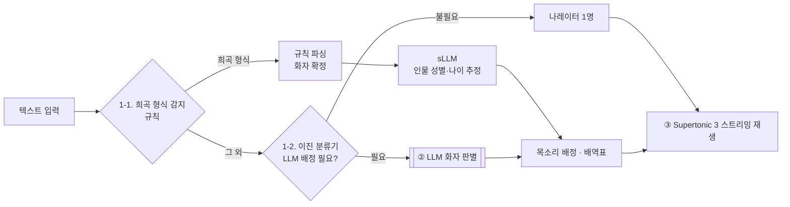

# 소캡디 – MVP 시스템 설계

## 개요

입력된 텍스트를 유형별로 나눈 뒤, 등장인물마다 다른 목소리로 실시간 재생한다. 희곡 형식은 규칙으로 먼저 걸러내고, 나머지 텍스트만 분류기가 "LLM을 활용한 목소리 배정이 필요한가"를 이진 분류한다. LLM은 소설처럼 대사가 섞인 텍스트에서만 호출한다.



호출 비용이 가장 큰 곳은 강조 표시한 LLM 화자 판별이다. 희곡은 화자가 이미 정해져 있으므로 인물의 성별·나이만 sLLM으로 추정한다. 목소리 배정이 필요 없는 텍스트는 배정 단계를 건너뛰고 바로 재생된다.

## ① 문서 유형 분류

희곡 형식은 규칙으로 먼저 걸러내고, 나머지 텍스트만 학습한 분류기로 판정한다. 이 단계의 목적은 LLM API 비용을 줄이는 것이다.

### 1-1. 희곡 형식 감지(규칙)

줄이 "인물명: 대사" 형식으로 반복되면 희곡으로 판정한다. 희곡은 규칙 파싱으로 대사별 화자를 확정하므로 화자 판별 LLM은 호출하지 않는다. 다만 목소리 배정을 위해 인물의 성별·나이는 sLLM으로 추정한다(2-0 참고). 분류기보다 싸고 확실하므로 이 규칙을 먼저 적용한다.

### 1-2. 이진 분류기: LLM을 활용한 목소리 배정이 필요한가

희곡 형식이 아닌 텍스트만 입력으로 받는다. 라벨은 장르(문학/비문학)가 아니라 LLM 화자 판별이 필요한지 여부다. 이 분류기가 풀어야 할 핵심 문제는 뉴스의 인용문과 소설의 대사를 구분하는 것이다.

- **모델**: KoELECTRA-small을 파인튜닝한다. ONNX로 변환하고 int8로 양자화해 CPU에서 돌린다(부록 참고).
- **라벨**

| 텍스트 | 라벨 | 비고 |
| --- | --- | --- |
| 소설, 웹소설, 동화 | 필요 | 인물별 목소리 |
| 뉴스(인용 포함) | 불필요 | 인용은 나레이터가 읽는다. 가장 헷갈리는 반례 |
| 블로그, 칼럼, 논문, 기술서적 | 불필요 | |
| 시 | 불필요(잠정) | 지원 대상에 넣을지 미정 |
| 수필 | 불필요(잠정) | 대화가 드물고, 있어도 회상 인용 |
| 희곡, 시나리오, "기자:" 형식 인터뷰 | 학습 데이터에서 제외 | 1-1 규칙이 먼저 처리한다 |

- **입력**: 모델은 최대 512토큰까지만 받는다. 텍스트 앞·중간·뒤에서 조각을 나눠 따로 분류하고, 그 결과를 평균 낸다.
- **학습 데이터**
  - 불필요: 뉴스·블로그 말뭉치(모두의 말뭉치, AI Hub 등)
  - 필요: 저작권이 만료된 한국 소설(공유마당, 위키문헌 등)
  - 각 샘플에 `label`과 함께 `genre`(뉴스, 소설, 시 등)를 저장한다. 장르별 오류 분석이 가능하고, 나중에 다중 분류로 바꿔도 데이터를 다시 모을 필요가 없다.
  - train/val/test는 문서 단위(`doc_id`)로 나눈다. 같은 작품의 조각이 여러 세트에 섞이지 않게 한다.
- **애매한 경우**: 오류 비용이 비대칭이다. "필요"를 "불필요"로 놓치면 작품 전체가 한 목소리로 나온다. 반대 경우는 LLM 호출 비용만 든다. 그래서 "필요" 재현율을 우선하고, 확신도가 낮으면 "필요"로 분류한다.

| 판정 | 처리 | 호출 |
| --- | --- | --- |
| 희곡 형식(규칙) | 규칙 파싱 + 인물 성별·나이 추정 | sLLM |
| 배정 불필요(분류기) | 나레이터 1명 | 없음 |
| 배정 필요(분류기) | LLM으로 화자 판별 | LLM |

## ② 화자 판별과 목소리 배정

LLM이 텍스트 전체를 한 번만 분석해 등장인물과 대사별 화자를 뽑는다. 그 결과로 작품별 배역표를 만든다. MVP에서는 개발자 본인의 API 키를 쓰고, 추후 유료로 판매할 계획이다.

### 2-0. 희곡: sLLM으로 인물 성별·나이 추정

희곡은 1-1 규칙 파싱으로 대사별 화자가 이미 정해져 있다. 목소리 배정에 필요한 인물의 성별과 대략적인 나이만 sLLM으로 추정한다. 입력은 인물명과 그 인물의 대사·지문 일부이고, 출력은 2-2의 `characters`와 같은 형식이다. 이후 배정은 2-3 규칙을 똑같이 따른다.

### 2-1. 등장인물 식별(전체 텍스트를 1회 분석)

- LLM으로 등장인물의 이름, 별칭, 성별, 대략적인 나이를 뽑는다.
- 분석 중에는 "잠시 기다려주세요, 성우들을 데려오고 있습니다"라는 안내 문구와 진행률을 보여준다.
- 분석 결과는 텍스트 해시나 작품 ID를 키로 해서 캐시한다. 같은 텍스트를 다시 열면 LLM을 다시 호출하지 않는다.

### 2-2. 대사별 등장인물 매칭

LLM의 출력 형식(JSON)은 다음과 같다.

```json
{
  "characters": [{"id": "A", "name": "철수", "aliases": ["김 대리"], "gender": "M", "age": "30대"}],
  "lines": [
    {"idx": 0, "speaker": "NARRATOR", "text": "..."},
    {"idx": 1, "speaker": "A", "text": "..."}
  ]
}
```

### 2-3. 목소리 배정 규칙

- 성별과 나이에 맞는 목소리를 고른다.
- 나레이터 목소리는 등장인물에게 배정하지 않는다.
- 대사를 연달아 주고받는 두 인물에게는 서로 다른 목소리를 준다.
- 인물이 10명을 넘으면 조연에게 음높이나 속도를 바꾼 변형 목소리를 준다.
- 성별을 알 수 없는 인물에게는 중립적인 기본 목소리를 준다.

| 배역 | 목소리(예시) |
| --- | --- |
| 나레이터 | M5 |
| A | M1 |
| B | M2 |
| C | F1 |

### 2-4. 배역표 저장과 수정

- 배역표(인물과 목소리의 짝)는 작품 단위로 저장한다. 다음 회차를 읽을 때도 같은 목소리를 유지한다.
- 사용자가 인물의 목소리나 대사의 화자를 고치면 배역표에 즉시 반영한다.

## ③ TTS 음성 생성과 재생(실시간 스트리밍)

전체 합성이 끝날 때까지 기다리지 않는다. 첫 조각이 준비되면 바로 재생을 시작하고, mp3 내보내기는 부가 기능으로 둔다. TTS 엔진은 Supertonic 3를 CPU에서 온디바이스로 돌린다.

1. **재생 단위 분할**: 텍스트를 `{순번, 화자, 목소리, 텍스트}` 형태의 조각으로 나눈다.
2. **선합성 버퍼**: 한 조각을 재생하는 동안 다음 2~3개 조각을 미리 합성해 둔다. CPU 2코어에서 측정하니 합성 시간이 재생 시간의 약 0.3배였다. 따라서 합성이 재생을 충분히 앞서갈 수 있다.
3. **재생 제어**: 일시정지, 이전/다음 문장 이동, 속도 조절을 지원한다. 화자가 바뀔 때는 짧은 무음을 넣는다.
4. **(부가 기능) mp3 내보내기**: 캐시해 둔 조각을 이어 붙여 mp3로 저장한다. MVP 이후에 만든다.

## 평가 항목

아래 다섯 가지는 개발 초기부터 측정할 수 있게 만든다. 측정 결과는 그대로 칡스톤 결과물이 된다.

| 항목 | 측정 방법 |
| --- | --- |
| 유형 분류 정확도 | 별도 테스트셋으로 정확도와 F1을 측정한다. "필요"를 "불필요"로 잘못 분류한 비율(필요 재현율)은 따로 보고, 장르별로도 나눠 본다. 따옴표 비율 같은 규칙 베이스라인과 비교한다. |
| 화자 판별 정확도 | 직접 라벨링한 희곡·소설 대사 200~500개로 측정한다. |
| 비용 | 1만 자당 LLM 비용, LLM 호출을 건너뛴 비율, 캐시 적중률을 본다. |
| 대기 시간 | 분석에 걸리는 시간과 첫 소리가 나오기까지의 시간을 잰다. |
| 사용자 경험 | 단일 목소리 TTS와 비교하는 블라인드 청취 테스트를 한다. |

## 개발 순서

CLI(Python, conda)로 시작한다. 데이터 수집에 시간이 가장 오래 걸리므로 분류기부터 만든다.

- [x] 프로젝트 뼈대(conda 환경, `immersive-tts` CLI)
- [ ] 이진 분류기: 데이터 수집 → 데이터셋 구성 → 규칙 베이스라인 → 파인튜닝 → 평가·임계값 → ONNX 변환 → `classify` 명령
- [ ] 희곡 입력 → 규칙 파싱 → sLLM 성별·나이 추정 → 배역 → Supertonic 스트리밍 재생
- [ ] 소설용 LLM 화자 판별과 결과 캐시
- [ ] 배역표 저장과 수정
- [ ] 평가 항목 측정
- [ ] (MVP 이후) mp3 내보내기, 감정 표현

## 부록: 분류기 ONNX 변환과 CPU 벤치마크

KoELECTRA-small을 int8로 양자화하면 모델 크기는 15MB, 512토큰 추론 시간은 약 65ms다. 측정 환경은 CPU 2코어와 ONNX Runtime이고, 측정일은 2026-10-09다. 학습 전 모델로 재 것이라 크기와 속도만 유효하며, 정확도는 학습 후에 따로 측정해야 한다.

| 모델 | 원본 크기 | int8 크기 | 512토큰 추론(int8) |
| --- | --- | --- | --- |
| [KoELECTRA-small v3](https://huggingface.co/monologg/koelectra-small-v3-discriminator) | 57MB | 15MB | 약 65ms |
| [KLUE-BERT-base](https://huggingface.co/klue/bert-base) | 443MB | 111MB | 약 144ms |

- **변환 절차**: Hugging Face에서 파인튜닝한다. 그다음 `optimum-cli export onnx --task text-classification`으로 ONNX로 내보내고, `quantize_dynamic`으로 int8 양자화한다.
- **토크나이저**: ONNX 파일에는 모델만 들어 있다. 토크나이저는 별도로 준비해야 하며, Python은 `tokenizers`, JS는 `transformers.js`를 쓴다.
- **모델 선택**: KoELECTRA-small로 시작한다. 정확도가 부족할 때만 KLUE-BERT로 바꾼다.

---

원본: https://claude.ai/code/artifact/2f63bc8e-4950-40c8-8a82-5d322f913def (rev 14에서 가져옴). 2026-10-09 분류 단계 결정(희곡 규칙 우선, 희곡 sLLM, 이진 분류 라벨 재정의)은 이 파일에만 반영되어 있다.
